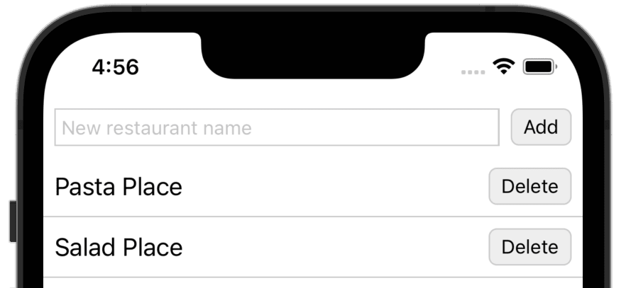
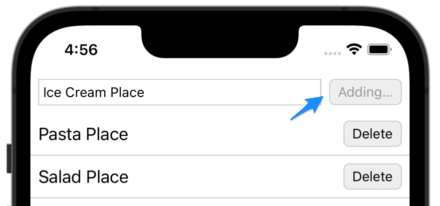
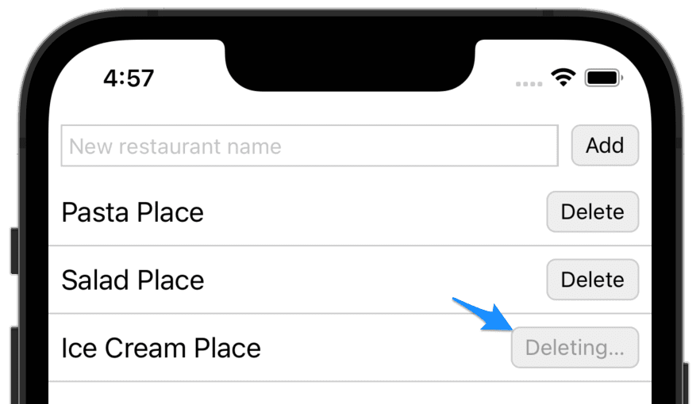

# Getting Better All the Time - Tutorial

by Josh Justice

*An extended version of the code exercise presented at React Native EU 2022.*

*The code for this tutorial is available in a [GitHub repo](https://github.com/CodingItWrong/getting-better-expo) if you'd like to follow along or play with it yourself.*

## The Story

Say we have this screen that displays a list of restaurants from a server, and allows us to add a new restaurant to the list:



The server is a bit slow. When we add a restaurant, the Add button is visibly deactivated, showing us that the add is in progress:



But there is no corresponding loading state for the Delete buttons; while they run, they are still active.

Let's take a look at the code we have to work with. This'll take a little scrolling:


```jsx
import {useState} from 'react';
import {
  FlatList,
  Pressable,
  StyleSheet,
  Text,
  TextInput,
  View,
} from 'react-native';
import api from './api';

export default function RestaurantList({
  restaurants,
  loading,
  loadError,
  reloadRestaurants,
}) {
  const [name, setName] = useState('');
  const [adding, setAdding] = useState(false);
  const [updateErrorMessage, setUpdateErrorMessage] = useState(null);

  if (loading) {
    return <Text style={styles.message}>Loading…</Text>;
  }

  if (loadError) {
    return (
      <Text style={[styles.message, styles.error]}>
        An error occurred while loading the restaurants
      </Text>
    );
  }

  return (
    <View style={styles.container}>
      <View style={styles.addRow}>
        <TextInput
          placeholder="New restaurant name"
          value={name}
          onChangeText={setName}
          style={styles.newRestaurantNameField}
        />
        <Pressable
          testID="add-button"
          disabled={adding}
          style={[styles.button, styles.addButton]}
          onPress={() => {
            setAdding(true);
            api
              .post('/restaurants', {name})
              .then(() => reloadRestaurants())
              .then(() => {
                setName('');
                setAdding(false);
              })
              .catch(() =>
                setUpdateErrorMessage(
                  'An error occurred adding the restaurant',
                ),
              );
          }}
        >
          <Text style={adding && styles.buttonTextDisabled}>
            {adding ? 'Adding…' : 'Add'}
          </Text>
        </Pressable>
      </View>
      {updateErrorMessage && (
        <Text style={[styles.message, styles.error]}>{updateErrorMessage}</Text>
      )}
      <FlatList
        data={restaurants}
        keyExtractor={item => item.id}
        renderItem={({item}) => (
          <View style={styles.restaurantRow}>
            <Text style={styles.restaurantName}>{item.name}</Text>
            <Pressable
              style={styles.button}
              onPress={() =>
                api
                  .delete(`/restaurants/${item.id}`)
                  .then(() => reloadRestaurants())
                  .catch(() =>
                    setUpdateErrorMessage(
                      'An error occurred deleting the restaurant',
                    ),
                  )
              }
            >
              <Text>Delete</Text>
            </Pressable>
          </View>
        )}
      />
    </View>
  );
}

const styles = StyleSheet.create({
  button: {
    borderWidth: 1,
    borderColor: '#ccc',
    borderRadius: 6,
    alignItems: 'center',
    justifyContent: 'center',
    paddingHorizontal: 8,
    paddingVertical: 4,
    backgroundColor: '#eee',
  },
  buttonTextDisabled: {
    color: '#999',
  },
  container: {
    flex: 1,
  },
  addRow: {
    flexDirection: 'row',
    padding: 8,
  },
  newRestaurantNameField: {
    flex: 1,
    borderWidth: 1,
    borderColor: '#ccc',
    padding: 4,
  },
  addButton: {
    marginLeft: 8,
  },
  message: {
    fontSize: 18,
    padding: 8,
  },
  error: {
    color: 'red',
    fontSize: 18,
    padding: 8,
  },
  restaurantRow: {
    flexDirection: 'row',
    alignItems: 'center',
    borderBottomWidth: 1,
    borderColor: '#ccc',
    padding: 8,
  },
  restaurantName: {
    flex: 1,
    fontSize: 18,
  },
});
```

What do we think of this code? Here are some of my thoughts:

- There's a state item called `name`, but what name is that? We could guess it's the state of the new restaurant name text field but it's not obvious from the variable name.
- There's an `updateErrorMessage` state item, but it's not clear what it refers to. This screen doesn't really do any "updating", just "adding" and "deleting".
- The JSX structure is nested pretty deeply. Everything is using low-level RN core components, so you can't get a sense of higher-level concepts, even under the `FlatList`'s inline `renderItem` prop function.
- There are multi-line logic functions directly in the JSX, including nontrivial Promise chains. This means that presentation and *asynchronous* business logic are mixed in one place, making it hard to parse. And let's assume my team has standardized on using `async`/`await` over Promise chains when possible; this makes it even less familiar for us.
- The `FlatList`'s `keyExtractor` and `renderItem` functions both use `item` as an argument name, but it's not clear what an "item" is.
- There's a nontrivial amount of `StyleSheet` styles, because all of this screen's JSX tree is in this one file. This increases the effort it takes to find the styles that apply to a given component.

Now, we chose a file that is 150 lines long to make it manageable for a blog post. (it was already pretty long to scroll through!) A file of that length is probably manageable to figure out and work with it. But even in a file this short there are already all of the above problems. Think about when you've seen problems like these in files much longer. They can make the code very hard to work with, even to the point that you despair of ever fully understanding it.

Luckily, this screen is thoroughly covered by tests. That means we can make small changes to the code to make it better and easier to work with for our current story.

## Refactoring

The biggest thing that makes it hard for me to follow the logic of this component is the complex promise chains in the event handler props. Let's extract those arrow functions to variables.

We'll do one at a time. First, we'll copy the Add button function and assign it to a `handleAdd` variable declared inside the render function, then replace the prop with the `handleAdd` variable:

```diff
 export default function RestaurantList(...) {
...
+  const handleAdd = () => {
+    setAdding(true);
+    api
+      .post('/restaurants', {name})
+      .then(() => reloadRestaurants())
+      .then(() => {
+        setName('');
+        setAdding(false);
+      })
+      .catch(() =>
+        setUpdateErrorMessage(
+          'An error occurred adding the restaurant',
+        ),
+      );
+  }
...
   return (
...
     <Pressable
       testID="add-button"
       disabled={adding}
       style={[styles.button, styles.addButton]}
+      onPress={handleAdd}
-      onPress={() => {
-        setAdding(true);
-        api
-          .post('/restaurants', {name})
-          .then(() => reloadRestaurants())
-          .then(() => {
-            setName('');
-            setAdding(false);
-          })
-          .catch(() =>
-            setUpdateErrorMessage(
-              'An error occurred adding the restaurant',
-            ),
-          );
-        }}
       >
...
   );
 }
```

We save and the tests pass, giving us confidence we haven't broken anything.

Next, let's extract a `handleDelete` variable in the same way:

```diff
   const handleAdd = () => {
...
   };

+  const handleDelete = () =>
+    api
+      .delete(`/restaurants/${item.id}`)
+      .then(() => reloadRestaurants())
+      .catch(() =>
+        setUpdateErrorMessage(
+          'An error occurred deleting the restaurant',
+        ),
+      );
...
   return (
...
     <Pressable
       style={styles.button}
+      onPress={handleDelete}
-      onPress={() =>
-        api
-          .delete(`/restaurants/${item.id}`)
-          .then(() => reloadRestaurants())
-          .catch(() =>
-            setUpdateErrorMessage(
-              'An error occurred deleting the restaurant',
-            ),
-          )
-      }
    >
...
   );
```

When we save, both ESLint and our tests give us an error:

```
item is not defined
```

The reason for this is that `item` is a named argument passed to the `renderItem` callback passed to `FlatList`, and it doesn't exist at the top level of our render function. We can fix this quickly by explicitly passing `item` when we call `handleDelete`:

```diff
-  const handleDelete = () =>
+  const handleDelete = item =>
     api
       .delete(`/restaurants/${item.id}`)
...
   <Pressable
     style={styles.button}
-    onPress={handleDelete}
+    onPress={() => handleDelete(item)}
   >
```

We save, and the tests are back to passing again.

Next, say our team has standardized on using `function`-keyword functions instead of assigning arrow functions to constants. At first we assigned the arrow functions to constants because it was the smallest step we could take. And now we can change them to function declarations instead:

```diff
-const handleAdd = () => {
+function handleAdd() {}
   setAdding(true);
...
-};
+}
...
-const handleDelete = item =>
+function handleDelete(item) {
   api
     .delete(`/restaurants/${item.id}`)
...
+}
```

Again, we save after this small change and ensure the tests still pass. For the rest of this section of the tutorial, assume we save and rerun the tests after every change.

Say our team also has a convention of using `async/await` functions instead of Promise chains. These can be error-prone to rewrite, but with our test coverage we can do it safely. We'll change one at a time. First, `handleAdd`. The Promise implementation is:

```js
function handleAdd() {
  setAdding(true);
  api
    .post('/restaurants', {name})
    .then(() => reloadRestaurants())
    .then(() => {
      setName('');
      setAdding(false);
    })
    .catch(() =>
      setUpdateErrorMessage('An error occurred adding the restaurant'),
    );
}
```

We replace it with this `async`/`await` implementation:

```js
async function handleAdd() {
  try {
    setAdding(true);
    await api.post('/restaurants', {name});
    await reloadRestaurants();
    setName('');
    setAdding(false);
  } catch {
    setUpdateErrorMessage('An error occurred adding the restaurant');
  }
}
```

Next, `handleDelete`. We replace:

```js
function handleDelete(item) {
  api
    .delete(`/restaurants/${item.id}`)
    .then(() => reloadRestaurants())
    .catch(() =>
      setUpdateErrorMessage('An error occurred deleting the restaurant'),
    );
}
```

with:

```js
async function handleDelete(item) {
  try {
    await api.delete(`/restaurants/${item.id}`);
    await reloadRestaurants();
  } catch {
    setUpdateErrorMessage('An error occurred deleting the restaurant');
  }
}
```

Now, looking at `handleDelete`, I see another problem: the `item` variable name. What's an "item"? This screen doesn't work with "items"; it works with restaurants. We can rename that variable for clarity:

```diff
-async function handleDelete(item) {
+async function handleDelete(restaurant) {
   try {
-    await api.delete(`/restaurants/${item.id}`);
+    await api.delete(`/restaurants/${restaurant.id}`);
     await reloadRestaurants();
   } catch {
     setUpdateErrorMessage('An error occurred deleting the restaurant');
   }
 }
```

We can do the same for the `keyExtractor` and `renderItem` callbacks passed to the `FlatList`. Note that the argument passed to the latter is a named argument, which is probably where the name `item` came from, but we can still rename it:

```diff
 <FlatList
   data={restaurants}
-  keyExtractor={item => item.id}
-  renderItem={({item}) => (
+  keyExtractor={restaurant => restaurant.id}
+  renderItem={({item: restaurant}) => (
    <View style={styles.restaurantRow}>
```

Now, what other changes will help prepare us to add the loading state for the Delete button?

Right now, it's hard to add state for each Delete button, because each row is just some inline JSX in the `renderItem` callback. If we had a function for each row, that would give us a place to add the state.

Let's extract a new component for each row; we'll call it `RestaurantRow`. For convenience, we can declare it in the same file for now, underneath `RestaurantList`. We'll start by copying and pasting the JSX and letting ESLint tell us what props we need:

```jsx
function RestaurantRow() {
  return (
    <View style={styles.restaurantRow}>
      <Text style={styles.restaurantName}>{restaurant.name}</Text>
      <Pressable style={styles.button} onPress={() => handleDelete(restaurant)}>
        <Text>Delete</Text>
      </Pressable>
    </View>
  );
}
```

The first prop we need is the `restaurant`, and that's easy to add:

```diff
-function RestaurantRow() {
+function RestaurantRow({restaurant}) {
   return (
...
   );
 }
```

The other variable that's missing is `handleDelete`. But let's think about the design of this component. Does it seem typical to pass a `restaurant` to the component, and also a function that receives that `restaurant` unchanged? No, it's more typical to have a function that is called without any arguments. Let's call it `onDelete`:

```diff
-function RestaurantRow({restaurant}) {
+function RestaurantRow({restaurant, onDelete}) {
   return (
...
-      <Pressable style={styles.button} onPress={() => handleDelete(restaurant)}>
+      <Pressable style={styles.button} onPress={onDelete}>
         <Text>Delete</Text>
       </Pressable>
...
   );
 }
```

That addresses all the undefined variables. Now we can replace the inline JSX with a call to the `RestaurantRow` component:

```diff
 <FlatList
   data={restaurants}
   keyExtractor={restaurant => restaurant.id}
   renderItem={({item: restaurant}) => (
+    <RestaurantRow
+      restaurant={restaurant}
+      onDelete={() => handleDelete(restaurant)}
+    />
-    <View style={styles.restaurantRow}>
-      <Text style={styles.restaurantName}>{restaurant.name}</Text>
-      <Pressable
-        style={styles.button}
-        onPress={() => handleDelete(restaurant)}
-      >
-        <Text>Delete</Text>
-      </Pressable>
-    </View>
   )}
 />
```

We've finished extracting the `RestaurantRow` component. This removes some low-level details from `RestaurantList` and lets it operate at a higher level of abstraction. But it still has some other low-level details: the "add restaurant" row. Should we extract that into a `NewRestaurantForm` child component now?

We can, but we don't have to. If it would help us now, we have the test coverage to extract that child component safely. Or if it's not too much work, we could go ahead and do it to simplify the code. But we don't directly need that component extracted for the feature we're working on right now. We could defer it until later; a future developer will have the same test coverage to use to extract it at that time. Something might even change by then that would affect exactly what we extract. So there are benefits to waiting to make changes until they're needed for our current story.

Back to our `RestaurantRow` component. Now that we have it, we have a convenient place to add a state indicating that a delete operation is in progress.

```diff
 function RestaurantRow({restaurant, onDelete}) {
+  const [deleting, setDeleting] = useState(false);
+
   return (
...
   );
 }
```

Now we can set the `deleting` state in a `handleDelete` function, and call that instead of calling `onDelete` directly:

```diff
 function RestaurantRow({restaurant, onDelete}) {
   const [deleting, setDeleting] = useState(false);

+  async function handleDelete() {
+    setDeleting(true);
+    await onDelete();
+    setDeleting(false);
+  }
+
   return (
...
-    <Pressable style={styles.button} onPress={onDelete}>
+    <Pressable style={styles.button} onPress={handleDelete}>
...
   );
 }
```

With this, we have a `deleting` boolean we can use to implement the deleting state of the Delete button. We'll do three things:

- Set the `Pressable` to `disabled`,
- Style the button's text to be grayed out, and
- Change the button's text to say "Deleting…"

```diff
 return (
   <View style={styles.restaurantRow}>
     <Text style={styles.restaurantName}>{restaurant.name}</Text>
-    <Pressable style={styles.button} onPress={handleDelete}>
+    <Pressable
+      disabled={deleting}
+      style={styles.button}
+      onPress={handleDelete}
+    >
-      <Text>Delete</Text>
+      <Text style={deleting && styles.buttonTextDisabled}>
+        {deleting ? 'Deleting…' : 'Delete'}
+      </Text>
     </Pressable>
   </View>
 );
```

With this, we should have our deleting button working. Let's try it in the simulator:



The deleting state looks great, but after the delete completes we get a warning:

```
Can't perform a React state update on an unmounted component.
```

This is caused by our call to `setDeleting(false)`. This happens after the row has been deleted—but when it's deleted the row is removed. So we don't need to set `deleting` to `false` when the delete succeeds, but only when it fails. Let's do so:

```diff
 async function handleDelete() {
+  try {
     setDeleting(true);
     await onDelete();
+  } catch {
     setDeleting(false);
+  }
 }
```

With this, the warning goes away and the deleting state works great.

We were able to make these changes in small steps because we had good test coverage that gave us confidence to make those changes. But how can we get test coverage like that? Test-driven development.

Let's go back in time to before this screen was written and walk through the process of test-driving the functionality to get a test suite that thoroughly covers its functionality.

## Test-Driving the Screen

Let's say we're starting out with an empty `RestaurantList` component:

```js
export default function RestaurantList() {
  return null;
}
```

We also have an empty test for the component:

```js
describe('RestaurantList', () => {});
```

Now, what functionality do we need the component to have? Well, the main thing is displaying the passed-in restaurants. Let's write a test for that:

```js
const restaurants = [
  {id: 1, name: 'Pizza Place'},
  {id: 2, name: 'Salad Place'},
];

describe('when restaurants are available', () => {
  it('displays the restaurant names', () => {
    render(<RestaurantList restaurants={restaurants} />);

    expect(screen.queryByText(restaurants[0].name)).toBeTruthy();
    expect(screen.queryByText(restaurants[1].name)).toBeTruthy();
  });
});
```

We set up some test restaurant data, then render the `RestaurantList` component, passing the restaurants to it. Then we check to make sure that each restaurant's name appears in the component tree.

We save the test and it fails, as we expect:

```
 FAIL  src/RestaurantList.spec.js
  RestaurantList
    when restaurants are available
      ✕ displays the restaurant names (179 ms)

  ● RestaurantList › when restaurants are available › displays the restaurant names

    expect(received).toBeTruthy()

    Received: null

      12 |       render(<RestaurantList restaurants={restaurants} />);
      13 |
    > 14 |       expect(screen.queryByText(restaurants[0].name)).toBeTruthy();
         |                                                       ^
```

To make this test pass, let's output the restaurant names. Now, the simplest way we could implement this would be plain `Text` elements. But because this is React Native, we know we're going to be using a `FlatList` or something like it. We can go ahead and use the `FlatList` now; even if we change our minds later, our tests will support us as we change the implementation:

```diff
+import {FlatList, Text} from 'react-native';
+
-export default function RestaurantList() {
+export default function RestaurantList({restaurants}) {
-  return null;
+  return (
+    <FlatList
+      data={restaurants}
+      keyExtractor={item => item.id}
+      renderItem={({item}) => <Text>{item.name}</Text>}
+    />
+  );
 }
```

Save and the tests pass.

At this point we could refactor by styling the component, but let's hold off on doing so until we have more functionality.

What's a good next bit of functionality to add? The error message would be a good choice. Let's add a test for that. Add the following inside `describe('RestaurantList', …)`, after the "when restaurants are available" block:

```jsx
describe('when there is a load error', () => {
  it('displays an error message', () => {
    render(<RestaurantList loadError />);

    expect(
      screen.queryByText('An error occurred while loading the restaurants'),
    ).toBeTruthy();
  });
});
```

We pass a `loadError` prop; because we don't give it a value it will set the prop to `true`. We decide on the error message we want to see, and we look for it.

The test fails. Now, what's the simplest way we can make it pass? We can add the text directly into the rendered JSX:

```diff
 return (
+  <>
+    <Text>An error occurred while loading the restaurants</Text>
     <FlatList
       data={restaurants}
       keyExtractor={restaurant => restaurant.id}
       renderItem={({item: restaurant}) => <Text>{restaurant.name}</Text>}
     />
+  </>
 );
```

Save and the tests pass.

Now, this may be frustrating to you to see this. It may be obvious to you that we don't want to unconditionally show the error message, so why would we write it this way?

Yes, we want to conditionally hide the error message, but we also want *tests* that force us to do so. So rather than adding that logic right away, we'll add a test that forces us to implement the logic we want to have. What test will do that? When do we not want the error message to display?

We don't want the error message to display when the restaurants are successfully loaded. So let's add an assertion to the "when restaurants are available" test:

```diff
 describe('when restaurants are available', () => {
   it('displays the restaurant names', () => {
     render(<RestaurantList restaurants={restaurants} />);

     expect(screen.queryByText(restaurants[0].name)).toBeTruthy();
     expect(screen.queryByText(restaurants[1].name)).toBeTruthy();
+
+    expect(
+      screen.queryByText('An error occurred while loading the restaurants'),
+    ).toBeNull();
   });
 });
```

The test fails; now we will need to implement the logic to hide the error message to make it pass:

```diff
-export default function RestaurantList({restaurants}) {
+export default function RestaurantList({restaurants, loadError}) {
+  if (loadError) {
+    return <Text>An error occurred while loading the restaurants</Text>;
+  }
+
  return (
    <>
-     <Text>An error occurred while loading the restaurants</Text>
      <FlatList
        data={restaurants}
        keyExtractor={restaurant => restaurant.id}
        renderItem={({item: restaurant}) => <Text>{restaurant.name}</Text>}
      />
    </>
  );
}
```

So far we haven't done the "refactoring" step of red-green-refactor, but now something is jumping out at me: the duplicated error message string in the two tests. I'm worried that the two tests might get out of sync and lead to false positives or false negatives. For example, say I changed the error message to "LOAD ERROR!!!" but I only updated it in the error-state test. The test "when restaurants are available" would still be checking for the old error message, and it would still pass, but for the wrong reason: it would pass because that message is *never* shown. This means it wouldn't actually be protecting us: if we accidentally *did* show the error message in that case, the test would still pass, giving us a false positive.

How can we prevent these tests from getting out of sync? We can refactor by extracting the error message string to a constant:

```diff
 describe('RestaurantList', () => {
   const restaurants = [
     {id: 1, name: 'Pizza Place'},
     {id: 2, name: 'Salad Place'},
   ];
+  const loadErrorMessage = 'An error occurred while loading the restaurants';

   describe('when restaurants are available', () => {
...
-     expect(
-       screen.queryByText('An error occurred while loading the restaurants'),
-     ).toBeNull();
+     expect(screen.queryByText(loadErrorMessage)).toBeNull();
...
  });

  describe('when there is a load error', () => {
...
-     expect(
-       screen.queryByText('An error occurred while loading the restaurants'),
-     ).toBeTruthy();
+     expect(screen.queryByText(loadErrorMessage)).toBeTruthy();
...
  });
```

Save and the tests will still pass. But now they should be more robust against future change.

What is a good next bit of functionality to add? The loading message. Now, in your app you might use an animated loading indicator of some type, which you could look up in the test via an accessibility label. But for simplicity in this tutorial we'll use another textual message.

Let's start with a test for when the loading message should appear. Since we extracted the error message to a constant, we can foresee that we'll need to reuse the loading message too, so we can go ahead and define it in a constant:

```jsx
const loadingMessage = 'Loading…';

describe('while loading', () => {
  it('displays a loading indicator', () => {
    render(<RestaurantList loading />);

    expect(screen.queryByText(loadingMessage)).toBeTruthy();
  });
});
```

Make this test pass in the simplest way possible by adding the loading message unconditionally to the default returned JSX:

```diff
 return (
   <>
+    <Text>Loading…</Text>
     <FlatList
       data={restaurants}
       keyExtractor={restaurant => restaurant.id}
       renderItem={({item: restaurant}) => <Text>{restaurant.name}</Text>}
     />
   </>
 );
```

Now, in what scenarios would we *not* want to display the loading indicator? For one, once the restaurants have successfully been loaded. Let's add an assertion that will fail to that test:

```diff
 describe('when restaurants are available', () => {
   it('displays the restaurant names', () => {
     render(<RestaurantList restaurants={restaurants} />);

     expect(screen.queryByText(restaurants[0].name)).toBeTruthy();
     expect(screen.queryByText(restaurants[1].name)).toBeTruthy();

+    expect(screen.queryByText(loadingMessage)).toBeNull();
     expect(screen.queryByText(loadErrorMessage)).toBeNull();
   });
 });
```

We can make this test pass by moving the loading message to an early return, like we did with the error message:

```diff
-export default function RestaurantList({restaurants, loadError}) {
+export default function RestaurantList({restaurants, loading, loadError}) {
+  if (loading) {
+    return <Text>Loading…</Text>;
+  }
+
   if (loadError) {
     return <Text>An error occurred while loading the restaurants</Text>;
   }

   return (
     <>
-      <Text>Loading…</Text>
       <FlatList

```

Looking at our test file, we see we also have a test for when there is a load error. That's another scenario when we don't want to display the loading error message. Let's add an assertion to that effect:


```diff
 describe('when there is a load error', () => {
   it('displays an error message', () => {
     render(<RestaurantList loadError />);

     expect(screen.queryByText(loadErrorMessage)).toBeTruthy();
+
+    expect(screen.queryByText(loadingMessage)).toBeNull();
   });
 });
```

This test actually passes right away, because the conditional logic we added already handles this scenario. So this step wasn't actually test-driven development: we did not first add a failing test. That's okay, though: this is still valuable to add specification of the functionality of the component, to ensure we don't break it in the future.

Let's take a break from test-driving to run our app in the simulator. The loading indicator works and the data is displayed. It could really use some styling, though. As a refactoring step, let's add some styling. Add the following `StyleSheet` to the bottom of the file:

```js
const styles = StyleSheet.create({
  message: {
    fontSize: 18,
    padding: 8,
  },
  error: {
    color: 'red',
    fontSize: 18,
    padding: 8,
  },
  restaurantRow: {
    borderBottomWidth: 1,
    borderColor: '#ccc',
    padding: 8,
  },
  restaurantName: {
    fontSize: 18,
  },
});
```

Then add these styles to components throughout your JSX:

```diff
-import {FlatList, Text} from 'react-native';
+import {FlatList, Text, StyleSheet, View} from 'react-native';

 export default function RestaurantList({restaurants, loading, loadError}) {
   if (loading) {
-    return <Text>Loading…</Text>;
+    return <Text style={styles.message}>Loading…</Text>;
   }

   if (loadError) {
-    return <Text>An error occurred while loading the restaurants</Text>;
+    return (
+      <Text style={[styles.message, styles.error]}>
+        An error occurred while loading the restaurants
+      </Text>
+    );
   }

   return (
     <FlatList
       data={restaurants}
       keyExtractor={restaurant => restaurant.id}
-      renderItem={({item: restaurant}) => <Text>{restaurant.name}</Text>}
+      renderItem={({item: restaurant}) => (
+        <View style={styles.restaurantRow}>
+          <Text style={styles.restaurantName}>{restaurant.name}</Text>
+        </View>
+      )}
     />
    </View>
   );
 }
```

Check your updates in the simulator; it's nothing fancy but it looks usable at least. And you can always change the styling later with the tests giving you confidence that you haven't broken anything.

Now let's move on to test-driving the ability to add a restaurant. Let's start by adding the steps to add the restaurant and get the test passing, then after that we'll figure out what assertions to add:

```js
describe('when adding a restaurant succeeds', () => {
  const name = 'Burger Place';

  it('TBD', () => {
    render(<RestaurantList restaurants={[]} />);

    fireEvent.changeText(
      screen.getByPlaceholderText('New restaurant name'),
      name,
    );
    fireEvent.press(screen.getByText('Add'));
  });
});
```

Because we're using `fireEvent` for the first time, we need to import it:

```diff
-import {render, screen} from '@testing-library/react-native';
+import {fireEvent, render, screen} from '@testing-library/react-native';
 import RestaurantList from './RestaurantList';
```

We render the `RestaurantList` component. We want it to be in the state where the restaurants have already been loaded, but we don't need any restaurants to be present, so we can just pass an empty array as the `restaurants` prop.

Next, we fill in a text field with the new restaurant name. We find the text field by the placeholder that will display for the user.

Finally, we press/tap a button labeled "Add".

Save, and we get a failure:

```
Unable to find an element with placeholder: New restaurant name
```

We make just enough of a change to the production code to get past the current error or failure. In this case, we add a `TextInput` with the expected placeholder:

```diff
-import {FlatList, StyleSheet, Text, View} from 'react-native';
+import {FlatList, StyleSheet, Text, TextInput, View} from 'react-native';
...
 return (
   <>
+    <TextInput placeholder="New restaurant name" />
     <FlatList
```

Save, and we get a different test failure:

```
Unable to find an element with text: Add
```

Add an "Add" button:

```diff
-import {FlatList, StyleSheet, Text, TextInput, View} from 'react-native';
+import {
+  FlatList,
+  Pressable,
+  StyleSheet,
+  Text,
+  TextInput,
+  View,
+} from 'react-native';
...
 return (
   <>
     <TextInput placeholder="New restaurant name" />
+    <Pressable>
+      <Text>Add</Text>
+    </Pressable>
     <FlatList
```

Save and the tests pass. Note that we aren't hooking up the `TextInput` to state storage or the `Pressable` to a press handler yet: we'll wait for the test to drive us to implement that.

We're now doing all the interactions that should be necessary to add a restaurant. What expectations do we want to make about the result?

The most important thing we want to confirm is that the request is made to the server to add the restaurant. We have an `api` module that handles calls to the server, and we want to make that call directly in the component. We can assert that `api.post()` is called using Jest module mocking:

```diff
 import RestaurantList from './RestaurantList';
+import api from './api';
+
+jest.mock('./api');

 describe('RestaurantList', () => {
...
   describe('when adding a restaurant succeeds', () => {
     const name = 'Burger Place';

-    it('TBD', () => {
+    it('saves the restaurant to the server', () => {
       render(<RestaurantList restaurants={[]} />);

       fireEvent.changeText(
         screen.getByPlaceholderText('New restaurant name'),
         name,
       );
       fireEvent.press(screen.getByText('Add'));
+
+      expect(api.post).toHaveBeenCalledWith('/restaurants', {name});
     });
   });
```

To pass the test, we need to store the value of the `TextInput` in state so it's available to pass to the `api.post()` method:

```diff
+import {useState} from 'react';
 import {
   FlatList,
   Pressable,
   StyleSheet,
   Text,
   TextInput,
   View,
 } from 'react-native';
+import api from './api';

 export default function RestaurantList({restaurants, loading, loadError}) {
+  const [name, setName] = useState('');

   if (loading) {
...
   return (
     <>
-     <TextInput placeholder="New restaurant name" />
+     <TextInput
+       placeholder="New restaurant name"
+       value={name}
+       onChangeText={setName}
+     />
-     <Pressable>
+     <Pressable onPress={() => api.post('/restaurants', {name})}>
        <Text>Add</Text>
      </Pressable>
```

What else do we want to happen when we add a restaurant? Well, the way our app is implemented, instead of manually adding the restaurant to a locally-cached restaurant list, we reload the full restaurant list from the server, using a function passed in from the parent component. Let's assert that now. Because we will not reload until after the save to the server completes, we will need to change our test to an `async` test:

```diff
-import {fireEvent, render, screen, waitFor} from '@testing-library/react-native';
+import {
+  fireEvent,
+  render,
+  screen,
+  waitFor,
+} from '@testing-library/react-native';
...
-it('saves the restaurant to the server', () => {
-  render(<RestaurantList restaurants={[]} />);
+it('saves the restaurant to the server', async () => {
+  const reloadRestaurants = jest.fn().mockName('reloadRestaurants');
+
+  render(
+    <RestaurantList
+      restaurants={[]}
+      reloadRestaurants={reloadRestaurants}
+    />,
+  );

   fireEvent.changeText(
     screen.getByPlaceholderText('New restaurant name'),
     name,
   );
   fireEvent.press(screen.getByText('Add'));

   expect(api.post).toHaveBeenCalledWith('/restaurants', {name});
+
+  await waitFor(() => expect(reloadRestaurants).toHaveBeenCalledWith());
 });
```

We create a Jest mock function called `reloadRestaurants`, then we pass it as a prop to the `RestaurantList`. Then, after we confirm the restaurant has been added to the server, we confirm that `reloadRestaurants` has been called. This won't happen right away, but only after the call to the server returns. So we need to wrap this assertion in a call to `waitFor()`, which will retry the check repeatedly over the range of a few seconds. Also, we use the more specific `.toHaveBeenCalledWith()` method, not passing any arguments, to confirm that `reloadRestaurants` is called with no arguments. This ensures we don't accidentally pass it some data that could be confusing to future developers.

We should be able to get the test to pass by taking in the `reloadRestaurants` prop and calling it in a `.then()` callback:

```diff
-export default function RestaurantList({restaurants, loading, loadError}) {
+export default function RestaurantList({
+  restaurants,
+  loading,
+  loadError,
+  reloadRestaurants,
+}) {
   const [name, setName] = useState('');
...
-      <Pressable onPress={() => api.post('/restaurants', {name})}>
+      <Pressable
+        onPress={() =>
+          api.post('/restaurants', {name}).then(() => reloadRestaurants())
+        }
+      >
         <Text>Add</Text>
       </Pressable>
```

Save the file, but we get a surprising error in the production code:

```
TypeError: Cannot read properties of undefined (reading 'then')

  39 |       <Pressable
  40 |         onPress={() =>
> 41 |           api.post('/restaurants', {name}).then(() => reloadRestaurants())
     |           ^
```

Because we mocked the `api` module, `api.post()` returns a value of `undefined` by default. To get it to simulate a successful web service call, we need to configure it to return a Promise that resolves. Jest mocks have a simple API for this:

```diff
 it('saves the restaurant to the server', async () => {
+  api.post.mockResolvedValue();
+
   const reloadRestaurants = jest.fn().mockName('reloadRestaurants');
```

Save and the test passes.

Now, in a typical TDD process, you might identify that the promise chain in the `onPress` prop is getting complex, and would be good to refactor out into a standalone function. But remember that we're traveling back through time, and we don't want to change the future. Let's leave the code as-is, assuming that we didn't think to do this refactoring right now.

OK so, when we add a restaurant, the restaurant is sent to the server and the list is reloaded. Is there anything else we want to happen? Well, after all this succeeds, it would be good to clear out the `TextInput` so it's ready to add the next restaurant. Let's add an assertion to that effect:

```diff
 it('saves the restaurant to the server', async () => {
   api.post.mockResolvedValue();

   const reloadRestaurants = jest
     .fn()
-    .mockName('reloadRestaurants');
+    .mockName('reloadRestaurants')
+    .mockResolvedValue();
...
   await waitFor(() => expect(reloadRestaurants).toHaveBeenCalledWith());
+
+  expect(screen.getByPlaceholderText('New restaurant name')).toHaveProp(
+    'value',
+    '',
+  );
 });
```

We ensure `reloadRestaurants` returns a Promise that resolves, so that the result will be executed asynchronously. This makes our test more realistic to what will really happen. Then we assert that the `TextInput` should have a `value` of empty string, showing that its text was cleared.

We should be able to get this to pass by clearing the name in another `.then()` callback:

```diff
 <Pressable
   onPress={() =>
-    api.post('/restaurants', {name}).then(() => reloadRestaurants())
+    api
+      .post('/restaurants', {name})
+      .then(() => reloadRestaurants())
+      .then(() => setName(''))
   }
 >
```

Save and the test passes.

Next, let's test-drive the case when adding a restaurant fails. In that case, we want to show an error message:

```js
describe('when adding a restaurant fails', () => {
  it('shows an error message', async () => {
    api.post.mockRejectedValue();

    render(<RestaurantList restaurants={[]} />);

    fireEvent.changeText(
      screen.getByPlaceholderText('New restaurant name'),
      'Burger Place',
    );
    fireEvent.press(screen.getByText('Add'));

    await screen.findByText('An error occurred adding the restaurant');
  });
});
```

We configure the `api.post` method to return a Promise that rejects by calling `.mockRejectedValue()`; this simulates a server failure. After we go through the steps to add the restaurant, we wait for an error message to appear on the screen.

Save and we get the error:

```
thrown: undefined
```

To do the minimum to get past the current error, let's just catch that thrown error:

```diff
 <Pressable
   onPress={() =>
     api
       .post('/restaurants', {name})
       .then(() => reloadRestaurants())
       .then(() => setName(''))
+      .catch(() => {})
   }
 >
```

Save and now we get an assertion failure:

```
Unable to find an element with text: An error occurred adding the restaurant
```

To implement this, we can add a state variable storing the error. Thinking ahead to the fact that we will need to report delete errors too, let's have a single `updateErrorMessage` field that stores the error message for either update action:

```diff
 export default function RestaurantList({
   restaurants,
   loading,
   loadError,
   reloadRestaurants,
 }) {
   const [name, setName] = useState('');
+  const [updateErrorMessage, setUpdateErrorMessage] = useState(null);

   if (loading) {
...
       <Pressable
         onPress={() =>
           api
             .post('/restaurants', {name})
             .then(() => reloadRestaurants())
             .then(() => setName(''))
-            .catch(() => {})
+            .catch(() =>
+              setUpdateErrorMessage('An error occurred adding the restaurant'),
+            )
         }
       >
...
       <Text>Add</Text>
     </Pressable>
+    {updateErrorMessage && <Text>{updateErrorMessage}</Text>}
     <FlatList
```

Save and the test passes.

We need to add the disabled Add button state, but before we do so, let's go on to add the Delete functionality. We can circle back to the more sophisticated disabled button state afterward.

Deleting is fairly similar to adding, so we can write the test all in one go:

```js
describe('when deleting a restaurant succeeds', () => {
  it('deletes the restaurant from the server', async () => {
    api.delete.mockResolvedValue();

    const reloadRestaurants = jest.fn().mockName('reloadRestaurants');

    render(
      <RestaurantList
        restaurants={restaurants}
        reloadRestaurants={reloadRestaurants}
      />,
    );

    fireEvent.press(screen.getAllByText('Delete')[0]);

    expect(api.delete).toHaveBeenCalledWith(
      `/restaurants/${restaurants[0].id}`,
    );

    await waitFor(() => expect(reloadRestaurants).toHaveBeenCalledWith());
  });
});
```

We will be calling the `api.delete()` method to make the call to the server, so we mock it to resolve. We set up a `reloadRestaurants` mock function again. Then we render `RestaurantList`. This time we need to pass some `restaurants` so we have one available to delete. We tap the first `Delete` button we see, then confirm that a request was made to the server to delete the correct restaurant, and then that the restaurants are reloaded.

Let's continue to follow the practice of fixing one test failure at a time. First we have:

```
Unable to find an element with text: Delete
```

We fix this by adding a `Pressable` labeled "Delete" in the restaurant row:

```diff
 <View style={styles.restaurantRow}>
   <Text style={styles.restaurantName}>{restaurant.name}</Text>
+  <Pressable>
+    <Text>Delete</Text>
+  </Pressable>
 </View>
```

Next we get a failure saying that `api.delete` was not called. This is easy enough to fix:

```diff
-<Pressable>
+<Pressable
+  onPress={() => api.delete(`/restaurants/${restaurant.id}`)}
+>
   <Text>Delete</Text>
 </Pressable>
```

The next failure we get is that `reloadRestaurants` was not called. We can chain that again:

```diff
 <Pressable
-  onPress={() => api.delete(`/restaurants/${restaurant.id}`)}
+  onPress={() =>
+    api
+      .delete(`/restaurants/${restaurant.id}`)
+      .then(() => reloadRestaurants())
+  }
 >
```

Save and the test passes.

Now, let's test deletion failure:

```js
describe('when deleting a restaurant fails', () => {
  it('shows an error message', async () => {
    api.delete.mockRejectedValue();

    render(<RestaurantList restaurants={restaurants} />);

    fireEvent.press(screen.getAllByText('Delete')[0]);

    await screen.findByText('An error occurred deleting the restaurant');
  });
});
```

The first error we get is `thrown: undefined` again, so let's catch it:

```diff
 <Pressable
   onPress={() =>
     api
       .delete(`/restaurants/${restaurant.id}`)
       .then(() => reloadRestaurants())
+      .catch(() => {})
   }
 >
```

Next we get a failure that the error message isn't shown. That's easy to add with our `updateErrorMessage` state:

```diff
 onPress={() =>
   api
     .delete(`/restaurants/${restaurant.id}`)
     .then(() => reloadRestaurants())
-    .catch(() => {})
+    .catch(() =>
+      setUpdateErrorMessage('An error occurred deleting the restaurant'),
+     )
 }
```

With deleting handled, let's circle back to adding the loading state to the Add button. What do we want to assert about it? We shouldn't assert on visual styling in our tests, but we can confirm that the button's label is changed to "Adding…" and that it is disabled:

```diff
 describe('when adding a restaurant succeeds', () => {
   const name = 'Burger Place';
+  const addingLabel = 'Adding…';

   it('saves the restaurant to the server', async () => {
     api.post.mockResolvedValue();

     const reloadRestaurants = jest
       .fn()
       .mockName('reloadRestaurants')
       .mockResolvedValue();

     render(
       <RestaurantList
         restaurants={[]}
         reloadRestaurants={reloadRestaurants}
       />,
     );

     fireEvent.changeText(
       screen.getByPlaceholderText('New restaurant name'),
       name,
     );
     fireEvent.press(screen.getByText('Add'));

+    expect(screen.queryByText(addingLabel)).toBeTruthy();
+    expect(screen.getByTestId('add-button')).toHaveProp(
+      'accessibilityState',
+      {disabled: true},
+    );

     expect(api.post).toHaveBeenCalledWith('/restaurants', {name});

     await waitFor(() => expect(reloadRestaurants).toHaveBeenCalledWith());

     expect(screen.getByPlaceholderText('New restaurant  name')).toHaveProp(
       'value',
       '',
     );
+    expect(screen.queryByText(addingLabel)).toBeNull();
+    expect(screen.getByTestId('add-button')).toHaveProp(
+      'accessibilityState',
+      {disabled: false},
+    );
   });
 });
```

We put the "Adding…" label into a variable because we'll be checking for it several times. The first failure we get is that the adding label wasn't found. We can fix this with an `adding` state value that we set to `true` when adding begins:

```diff
 const [name, setName] = useState('');
+const [adding, setAdding] = useState(false);
 const [updateErrorMessage, setUpdateErrorMessage] = useState(null);
...
     <Pressable
-      onPress={() =>
+      onPress={() => {
+        setAdding(true);
         api
           .post('/restaurants', {name})
           .then(() => reloadRestaurants())
           .then(() => setName(''))
           .catch(() =>
             setUpdateError('An error occurred adding the restaurant'),
-          )
-      }
+          );
+      }}
     >
-      <Text>Add</Text>
+      <Text>{adding ? 'Adding…' : 'Add'}</Text>
     </Pressable>
```

Save and we get a new error: we can't find an element with test ID `add-button`. Because we need to look up the `Pressable` itself instead of text on it, we need a test ID to reference it directly. Fix just this error by adding that test ID:

```diff
 <Pressable
+  testID="add-button"
   onPress={() => {
```

Save and we get the failure:

```
Expected the element to have prop:
  accessibilityState={"disabled": true}
Received:
  null
```

You might think that the simplest way to fix this failure is to hard-code the `disabled` prop. But this won't actually work in this case because RNTL won't call the `onPress` function for a disabled button. So we need to go ahead and implement the `disabled` prop conditionally:

```diff
 <Pressable
   testID="add-button"
+  disabled={adding}
   onPress={() => {
 }
```

Now we get a failure on the expectation:

```js
expect(screen.queryByText(addingLabel)).toBeNull();
```

To get the "Adding…" label to disappear, set `adding` back to `false` after success:

```diff
 api
   .post('/restaurants', {name})
   .then(() => reloadRestaurants())
-  .then(() => setName(''))
+  .then(() => {
+    setAdding(false);
+    setName('');
+   })
   .catch(() =>
     setUpdateError('An error occurred adding the restaurant'),
   );
```

Now the test passes. The check to confirm that `disabled` is `false` passes because setting `adding` to `false` is already configured to affect not only the label but also the disabled state.

Now that we've finished all this functionality, let's check it out in the simulator again. We could once again use some more styling. Let's add more styles:

```diff
 const styles = StyleSheet.create({
+  button: {
+    borderWidth: 1,
+    borderColor: '#ccc',
+    borderRadius: 6,
+    alignItems: 'center',
+    justifyContent: 'center',
+    paddingHorizontal: 8,
+    paddingVertical: 4,
+    backgroundColor: '#eee',
+  },
+  buttonTextDisabled: {
+    color: '#999',
+  },
+  container: {
+    flex: 1,
+  },
+  addRow: {
+    flexDirection: 'row',
+    padding: 8,
+  },
+  newRestaurantNameField: {
+    flex: 1,
+    borderWidth: 1,
+    borderColor: '#ccc',
+    padding: 4,
+  },
+  addButton: {
+    marginLeft: 8,
+  },
   message: {
```

Then update the JSX to use them:

```diff
 return (
-  <>
+  <View style={styles.container}>
+    <View style={styles.addRow}>
       <TextInput
         placeholder="New restaurant name"
         value={name}
         onChangeText={setName}
+        style={styles.newRestaurantNameField}
       />
       <Pressable
         testID="add-button"
         disabled={adding}
+        style={[styles.button, styles.addButton]}
         onPress={() => {
           setAdding(true);
           api
             .post('/restaurants', {name})
             .then(() => reloadRestaurants())
             .then(() => {
               setAdding(false);
               setName('');
             })
             .catch(() =>
               setUpdateErrorMessage(
                 'An error occurred adding the restaurant',
               ),
             );
         }}
       >
-       <Text>{adding ? 'Adding…' : 'Add'}</RestaurantList>Text>
+       <Text style={adding && styles.buttonTextDisabled}>
+          {adding ? 'Adding…' : 'Add'}
+        </Text>
       </Pressable>
+    </View>
-    {updateErrorMessage && <Text>{updateErrorMessage}</Text>}
+    {updateErrorMessage && (
+      <Text style={[styles.message, styles.error]}>{updateErrorMessage}</Text>
+    )}
     <FlatList
       data={restaurants}
       keyExtractor={restaurant => restaurant.id}
       renderItem={({item: restaurant}) => (
         <View style={styles.restaurantRow}>
           <Text style={styles.restaurantName}>{restaurant.name}</Text>
           <Pressable
+            style={styles.button}
             onPress={() =>
               api
                 .delete(`/restaurants/${restaurant.id}`)
                 .then(() => reloadRestaurants())
                 .catch(() =>
                   setUpdateErrorMessage(
                     'An error occurred deleting the restaurant',
                   ),
                 )
             }
           >
             <Text>Delete</Text>
           </Pressable>
         </View>
       )}
     />
-  </>
+  </View>
 );
```

## More Test Coverage

Now that we've seen the benefits of refactoring and how to TDD to get there, let's explore this codebase a bit more.

First, let's add a test for that new Delete loading state we just added.

Like with our Add test, after we click the button we'll confirm that it is disabled and gets the new loading-state label:

```diff
 describe('when deleting a restaurant succeeds', () => {
   it('deletes the restaurant from the server', async () => {
...
     fireEvent.press(screen.getAllByText('Delete')[0]);

+    expect(screen.queryByText('Deleting…')).toBeTruthy();
+    expect(screen.getAllByTestId('delete-button')[0]).toHaveProp(
+      'accessibilityState',
+      {disabled: true},
+    );

     expect(api.delete).toHaveBeenCalledWith(
       `/restaurants/${restaurants[0].id}`,
     );
```

Unlike with our Add test, though, we won't test for the state to change back after success; we removed that functionality when we saw it wasn't needed and caused an error updating an unmounted component.

Save and the test fails because there is no JSX element with test ID `delete-button`. Add that to the delete Pressable:

```diff
 <Pressable
+  testID="delete-button"
   disabled={deleting}
   style={styles.button}
   onPress={handleDelete}
 >
```

Save and the test passes.

Now let's test the loading state for delete failure. In this case we *do* need to confirm that the button is reactivated:

```diff
 describe('when deleting a restaurant fails', () => {
   it('shows an error message', async () => {
...
     fireEvent.press(screen.getAllByText('Delete')[0]);

+    expect(screen.queryByText('Deleting…')).toBeTruthy();
+    expect(screen.getAllByTestId('delete-button')[0]).toHaveProp(
+      'accessibilityState',
+      {disabled: true},
+    );

     await screen.findByText('An error occurred deleting the restaurant');

+    expect(screen.queryByText('Deleting…')).toBeNull();
+    expect(screen.getAllByTestId('delete-button')[0]).toHaveProp(
+      'accessibilityState',
+      {disabled: false},
+    );
   });
 });
```

We expect that the test will pass. Save, and note that we actually get an assertion failure on:

```js
expect(screen.queryByText('Deleting…')).toBeNull();
```

It might take a little `console.log()` debugging, but what I discovered is that there really is a bug in our implementation. The `handleDelete` function in `RestaurantRow` expects `onDelete` to throw if there is an error saving:

```js
async function handleDelete() {
  try {
    setDeleting(true);
    await onDelete();
  } catch {
    setDeleting(false);
  }
}
```

However, the `handleDelete` function in `RestaurantList` doesn't throw if there is an error saving. Instead, it swallows the error, resulting in the promise it returns resolving:

```js
async function handleDelete(restaurant) {
  try {
    await api.delete(`/restaurants/${restaurant.id}`);
    await reloadRestaurants();
  } catch {
    setUpdateErrorMessage('An error occurred deleting the restaurant');
    // Since the exception has been caught, the returned Promise resolves
  }
}
```

To fix this, we can update the `handleDelete` function in `RestaurantList` to re-throw the exception after it sets the `updateErrorMessage`:

```diff
 try {
   await api.delete(`/restaurants/${restaurant.id}`);
   await reloadRestaurants();
-} catch {
+} catch (e) {
   setUpdateErrorMessage('An error occurred deleting the restaurant');
+  throw e;
 }
```

Save and the test passes.

This is an actual mistake I made while writing this exercise, but rather than take it out, I'm leaving it in as a demonstration of the value that thorough tests provide!

## More Refactoring

Let's explore other kinds of refactoring we could do. For one thing, we decided not to extract the new restaurant form to a child component the way we did with the `RestaurantRow`. Let's extract it now. Copy and paste the JSX to a new `NewRestaurantForm` component function in the same file:

```jsx
function NewRestaurantForm() {
  return (
    <View style={styles.addRow}>
      <TextInput
        placeholder="New restaurant name"
        value={name}
        onChangeText={setName}
        style={styles.newRestaurantNameField}
      />
      <Pressable
        testID="add-button"
        disabled={adding}
        style={[styles.button, styles.addButton]}
        onPress={handleAdd}
      >
        <Text style={adding && styles.buttonTextDisabled}>
          {adding ? 'Adding…' : 'Add'}
        </Text>
      </Pressable>
    </View>
  );
}
```

Next, let's follow the ESLint failures to add the variables we need.

First, `name` and `setName` are needed. That's state that's local to the form, so let's add it:

```diff
 function NewRestaurantForm() {
+  const [name, setName] = useState('');

   return (
     <View style={styles.addRow}>
```

Next, there's the `adding` state. Let's add that into the form as well:

```diff
 function NewRestaurantForm() {
   const [name, setName] = useState('');
+  const [adding, setAdding] = useState(false);

   return (
     <View style={styles.addRow}>
```

Now, we need the `handleAdd` function. Because we need the local `adding` state to be updated, let's follow the same pattern as the `RestaurantRow` and define a local `handle` function that updates the local state and delegates to a function prop for everything else:

```diff
-function NewRestaurantForm() {
+function NewRestaurantForm({onAdd}) {
   const [name, setName] = useState('');
   const [adding, setAdding] = useState(false);

+  async function handleAdd() {
+    setAdding(true);
+    await onAdd(name);
+    setAdding(false);
+    setName('');
+  }

  return (
```

Now we can replace the JSX in the parent component with a call to `NewRestaurantForm`, and remove the functionality for the child state in its `handleAdd` function:

```diff
 export default function RestaurantList({
   restaurants,
   loading,
   loadError,
   reloadRestaurants,
 }) {
...
-  const [name, setName] = useState('');
-  const [adding, setAdding] = useState(false);
   const [updateErrorMessage, setUpdateErrorMessage] = useState(null);

-  async function handleAdd() {
+  async function handleAdd(name) {
     try {
-      setAdding(true);
       await api.post('/restaurants', {name});
       await reloadRestaurants();
-      setName('');
-      setAdding(false);
     } catch {
...
   return (
     <View style={styles.container}>
-      <View style={styles.addRow}>
-        <TextInput
-          placeholder="New restaurant name"
-          value={name}
-          onChangeText={setName}
-          style={styles.newRestaurantNameField}
-        />
-        <Pressable
-          testID="add-button"
-          disabled={adding}
-          style={[styles.button, styles.addButton]}
-          onPress={handleAdd}
-        >
-          <Text style={adding && styles.buttonTextDisabled}>
-            {adding ? 'Adding…' : 'Add'}
-          </Text>
-        </Pressable>
-      </View>
+      <NewRestaurantForm onAdd={handleAdd} />
       {updateErrorMessage && (
```

Save and the tests should pass.

What else can we do? It's totally fine to have child components in the same JS file in React. But one downside is that your file is just as big as before, or bigger. You get more benefits of creating that level of abstraction if you don't need to see the implementation of `NewRestaurantForm` or `RestaurantRow` in the same file.

Let's try extracting these child components to separate files, starting with `NewRestaurantForm`. Create a file `NewRestaurantForm.js` in the `src` folder. Copy and paste the component into it, and make it the default export:

```js
export default function NewRestaurantForm({onAdd}) {
  const [name, setName] = useState('');
  const [adding, setAdding] = useState(false);

  async function handleAdd() {
    setAdding(true);
    await onAdd(name);
    setAdding(false);
    setName('');
  }

  return (
    <View style={styles.addRow}>
      <TextInput
        placeholder="New restaurant name"
        value={name}
        onChangeText={setName}
        style={styles.newRestaurantNameField}
      />
      <Pressable
        testID="add-button"
        disabled={adding}
        style={[styles.button, styles.addButton]}
        onPress={handleAdd}
      >
        <Text style={adding && styles.buttonTextDisabled}>
          {adding ? 'Adding…' : 'Add'}
        </Text>
      </Pressable>
    </View>
  );
}
````

ESLint will indicate React and React Native imports that are used by this component; add those at the top of the file:

```js
import {useState} from 'react';
import {Pressable, Text, TextInput, View} from 'react-native';
```

Also needed is the `styles` object. Here's where things get tricky. ESLint can't let us know which properties of a React Native `StyleSheet` object are used. To figure out which need to be copied over into this file, look at each usage of `styles` and see if it's only used by the `NewRestaurantForm` component; if so, copy it over and remove it from `RestaurantList`'s `StyleSheet`. You'll end up with

```js
const styles = StyleSheet.create({
  addRow: {
    flexDirection: 'row',
    padding: 8,
  },
  newRestaurantNameField: {
    flex: 1,
    borderWidth: 1,
    borderColor: '#ccc',
    padding: 4,
  },
  addButton: {
    marginLeft: 8,
  },
});
```

Be sure to import `StyleSheet` too:

```diff
-import {Pressable, Text, TextInput, View} from 'react-native';
+import {Pressable, StyleSheet, Text, TextInput, View} from 'react-native';
```

There are a few styles that are trickier, though, because they're used both by `NewRestaurantForm` and other components: `button` and `buttonTextDisabled`. For these, we can create a new `src/sharedStyles.js` file and move them there, removing them from `RestaurantList`'s `StyleSheet` afterwards:

```js
const {StyleSheet} = require('react-native');

const sharedStyles = StyleSheet.create({
  button: {
    borderWidth: 1,
    borderColor: '#ccc',
    borderRadius: 6,
    alignItems: 'center',
    justifyContent: 'center',
    paddingHorizontal: 8,
    paddingVertical: 4,
    backgroundColor: '#eee',
  },
  buttonTextDisabled: {
    color: '#999',
  },
});

export default sharedStyles;
```

Update `RestaurantList` to reference the styles from that module (skipping `NewRestaurantForm` because we're extracting it now):

```diff
 import api from './api';
+import sharedStyles from './sharedStyles';

 export default function RestaurantList({
   restaurants,
...
       <Pressable
         testID="add-button"
         disabled={adding}
-        style={[styles.button, styles.addButton]}
+        style={[sharedStyles.button, styles.addButton]}
         onPress={handleAdd}
       >
-        <Text style={adding && styles.buttonTextDisabled}>
+        <Text style={adding && sharedStyles.buttonTextDisabled}>
           {adding ? 'Adding…' : 'Add'}
         </Text>
       </Pressable>
...
       <Pressable
         testID="delete-button"
         disabled={deleting}
-        style={styles.button}
+        style={sharedStyles.button}
         onPress={handleDelete}
       >
-        <Text style={deleting && styles.buttonTextDisabled}>
+        <Text style={deleting && sharedStyles.buttonTextDisabled}>
           {deleting ? 'Deleting…' : 'Delete'}
         </Text>
       </Pressable>
```

Then update `NewRestaurantForm.js` to use `sharedStyles.js` as well:

```diff
 import {Pressable, StyleSheet, Text, TextInput, View} from 'react-native';
+import sharedStyles from './sharedStyles';
...
       <Pressable
         testID="add-button"
         disabled={adding}
-        style={[styles.button, styles.addButton]}
+        style={[sharedStyles.button, styles.addButton]}
         onPress={handleAdd}
       >
-        <Text style={adding && styles.buttonTextDisabled}>
+        <Text style={adding && sharedStyles.buttonTextDisabled}>
           {adding ? 'Adding…' : 'Add'}
         </Text>
       </Pressable>
```

With that, `NewRestaurantForm.js` should be ready. Import it into `RestaurantList.js` and remove the version of `NewRestaurantForm` defined in that file:

```diff
-import {
-  FlatList,
-  Pressable,
-  StyleSheet,
-  Text,
-  TextInput,
-  View,
-} from 'react-native';
+import {FlatList, Pressable, StyleSheet, Text, View} from 'react-native';
 import api from './api';
 import sharedStyles from './sharedStyles';
+import NewRestarantForm from './NewRestaurantForm';

 export default function RestaurantList({
...
-function NewRestaurantForm({onAdd}) {
-  ...
-}
```

In `RestaurantList.js, double-check that you removed all of the `styles` that were moved to `NewRestaurantForm.js` or `sharedStyles.js`. Here is what should remain:

```js
const styles = StyleSheet.create({
  container: {
    flex: 1,
  },
  message: {
    fontSize: 18,
    padding: 8,
  },
  error: {
    color: 'red',
    fontSize: 18,
    padding: 8,
  },
  restaurantRow: {
    flexDirection: 'row',
    alignItems: 'center',
    borderBottomWidth: 1,
    borderColor: '#ccc',
    padding: 8,
  },
  restaurantName: {
    flex: 1,
    fontSize: 18,
  },
});
```

The tests should pass, confirming that no functionality is broken. Pull up the app in the simulator to make sure the styling isn't broken either.

Next, let's extract RestaurantRow to a file. Create `RestaurantRow.js` and copy the component over to it, again exporting it as the default:

```jsx
export default function RestaurantRow({restaurant, onDelete}) {
  const [deleting, setDeleting] = useState(false);

  async function handleDelete() {
    try {
      setDeleting(true);
      await onDelete();
    } catch {
      setDeleting(false);
    }
  }

  return (
    <View style={styles.restaurantRow}>
      <Text style={styles.restaurantName}>{restaurant.name}</Text>
      <Pressable
        testID="delete-button"
        disabled={deleting}
        style={sharedStyles.button}
        onPress={handleDelete}
      >
        <Text style={deleting && sharedStyles.buttonTextDisabled}>
          {deleting ? 'Deleting…' : 'Delete'}
        </Text>
      </Pressable>
    </View>
  );
}
```

Add the necessary imports from React, RN, and `sharedStyles.js`:

```js
import {useState} from 'react';
import {Pressable, Text, View} from 'react-native';
import sharedStyles from './sharedStyles';
```

ESLint informs us of the remaining references to `styles`, so create a new `StyleSheet` and move over the styles specific to this file, deleting them from `RestaurantList.js`:

```js
const styles = StyleSheet.create({
  restaurantRow: {
    flexDirection: 'row',
    alignItems: 'center',
    borderBottomWidth: 1,
    borderColor: '#ccc',
    padding: 8,
  },
  restaurantName: {
    flex: 1,
    fontSize: 18,
  },
});
```

Import `StyleSheet`:

```diff
 import {useState} from 'react';
-import {Pressable, Text, View} from 'react-native';
+import {Pressable, StyleSheet, Text, View} from 'react-native';
 import sharedStyles from './sharedStyles';
```

Then replace the `RestaurantRow` declared in `RestaurantList.js` with an import from `RestaurantRow.js`:

```diff
 import NewRestaurantForm from './NewRestaurantForm';
+import RestaurantRow from './RestaurantRow';
 import api from './api';
...
-function RestaurantRow({restaurant, onDelete}) {
-  ...
-});
```

Remove imports that ESLint says are no longer used:

```diff
-import {FlatList, Pressable, StyleSheet, Text, View} from 'react-native';
+import {FlatList, StyleSheet, Text, View} from 'react-native';
 import NewRestaurantForm from './NewRestaurantForm';
 import RestaurantRow from './RestaurantRow';
 import api from './api';
-import sharedStyles from './sharedStyles';

 export default function RestaurantList({
```

Once again, confirm the tests are still passing, then look at the app in the simulator to make sure the styles are still correct.

Notice a few things that are simpler in each file now: each file has not quite so many imports from React Native, showing that it has fewer responsibilities. And each file has fewer styles defined, making it easier to see which styles are used and maintain them.

## Testing Individual Components

We extracted these child components under comprehensive tests, so we're confident that the extraction was safe. And while the components were functions not exported from the `RestaurantList` module, they were effectively implementation details of the `RestaurantList` component. Now that they are exported from their own modules, though, a question arises: should we test them directly?

[TRADEOFFS HERE]

For the sake of this tutorial, let's see what it looks like if you *do* try to test them directly.

Let's start with `RestaurantRow` as it's simpler. What are the responsibilities of `RestaurantRow`?

- Display the name of the restaurant
- Call the `onDelete` function prop when the Delete button is tapped, show a loading state, and clear the loading state _only_ if `onDelete` throws

Let's write tests for this. Create a new file `src/RestaurantRow.spec.js`. Add the test for the display of the restaurant name:

```jsx
import {render, screen} from '@testing-library/react-native';
import RestaurantRow from './RestaurantRow';

describe('RestaurantRow', () => {
  const restaurant = {name: 'Pizza Place'};

  it('displays the restaurant name', () => {
    render(<RestaurantRow restaurant={restaurant} />);

    expect(screen.queryByText(restaurant.name)).toBeTruthy();
  });
});
```

Note that our test `restaurant` doesn't need an `id` field, because we don't refer to it in this component; we only use the `name`.

Save and the test should pass, as we aren't doing test-driven development here; we're adding tests for existing functionality at a lower testing level.

Next, let's add a test for when delete succeeds:

```jsx
it('allows deleting the restaurant', () => {
  const onDelete = jest.fn().mockName('onDelete');

  render(<RestaurantRow restaurant={restaurant} onDelete={onDelete} />);

  fireEvent.press(screen.getByText('Delete'));

  expect(screen.queryByText('Deleting…')).toBeTruthy();

  expect(onDelete).toHaveBeenCalledWith();
});
```

Import `fireEvent` as we're using it for the first time:

```diff
-import {render, screen} from '@testing-library/react-native';
+import {fireEvent, render, screen} from '@testing-library/react-native';
 import RestaurantRow from './RestaurantRow';
```

Save and, again, the test will pass.

Note that this test is simpler because at the `RestaurantRow` level there aren't two asynchronous function calls to be made, just the one call to `onDelete`. This is one of the benefits of lower-level unit tests: they can be easier to follow.

The last scenario we need to test is when deleting a restaurant fails:

```jsx
it('re-enables the button if deleting fails', async () => {
  const onDelete = jest.fn().mockName('onDelete').mockRejectedValue();

  render(<RestaurantRow restaurant={restaurant} onDelete={onDelete} />);

  fireEvent.press(screen.getByText('Delete'));

  expect(screen.queryByText('Deleting…')).toBeTruthy();
  expect(screen.getByTestId('delete-button')).toHaveProp(
    'accessibilityState',
    {disabled: true},
  );

  expect(onDelete).toHaveBeenCalledWith();

  await waitForElementToBeRemoved(() => screen.getByText('Deleting…'));
  expect(screen.getByTestId('delete-button')).toHaveProp(
    'accessibilityState',
    {disabled: false},
  );
});
```

We import another new function from RNTL: `waitForElementToBeRemoved`:

```diff
-import {fireEvent, render, screen} from '@testing-library/react-native';
+import {
+  fireEvent,
+  render,
+  screen,
+  waitForElementToBeRemoved,
+} from '@testing-library/react-native';
 import RestaurantRow from './RestaurantRow';
```

Save and the test should pass.

Why is `waitForElementToBeRemoved` needed here but not in `RestaurantList.spec.js`? In both cases we need to wait for a Promise to resolve. In the test of `RestaurantList`, we can wait for the error message to display. But the error message isn't part of `RestaurantRow`; it's outside of it. Within a test of `RestaurantRow` in isolation, then, we need something else to wait for. What *does* change in the JSX tree that we can wait on? We could wait for the text "Delete" to appear again, but instead we wait for "Deleting…" to disappear. `waitForElementToBeRemoved` is the simplest API to do that.

## More to Come

The following will be added to this tutorial as time allows:

- A lower-level direct test of `NewRestaurantForm`
- Refactoring the visuals of the app to use [React Native Paper](https://reactnativepaper.com/) instead of custom styling
- Updating the data loading to use [React Query](https://tanstack.com/query/v4) instead of `useEffect`, without needing to change the screen's implementation or tests
